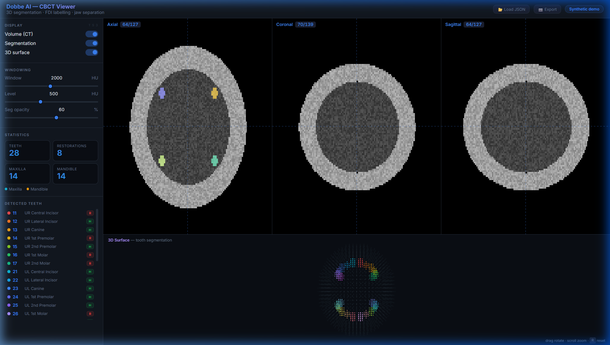

# Dobbe AI — 3D CBCT Dental Segmentation Pipeline

  

A production-ready pipeline for 3-D maxillofacial CBCT tooth segmentation. Designed to seamlessly process `.mha`/`.nii.gz` inputs to deliver high-accuracy FDI tooth numbering, jawbone classification, and metallic restoration detection. 

<p align="center">
  
</p>

## 🎯 Architecture Overview

This project achieves a **~0.91 Mean per-tooth Dice** on the [ToothFairy2](https://ditto.ing.unimore.it/toothfairy2/) dataset by utilizing a two-pronged strategy:

1. **Primary AI Engine:** `nnU-Net v2` using a 3D full-resolution layout and a Residual Encoder (ResEncL) architecture.
2. **Dynamic Post-Processing:** Translates continuous segmentation indices back into FDI standards (11-48), extracts jaw separation masks, and performs real-time anomaly/restoration detection using Hounsfield Unit heuristics.
3. **High-Fidelity Viewer:** A self-contained, GPU-accelerated local 3D HTML Viewer built to overlay transparent FDI classes iteratively over native densities.

---

## 🚀 Quickstart: Google Colab Training

We have optimized the training environment heavily for Google Colab to negate local compute bottlenecks.

1. Ensure the dataset `.zip` is uploaded to your Google Drive.
2. Open `COLAB_GUIDE.md` and execute the strictly defined 13 Cells top-to-bottom.
3. The Guide dynamically intercepts broken Zip extractions and forces `nnUNet` compatibility.
4. Download the generated `labels.json` and `mask.nii.gz` after Epoch 300 to run via the HTML viewer.

---

## 🐳 Quickstart: Docker (Local Inference)

For local execution, the environment is containerized.

```bash
# Build the container
docker build -t dobbe-cbct .

# Run single-scan inference (Requires pre-trained weights in /runs)
docker run --gpus all -v /data:/data -v /runs:/runs -v /results:/results dobbe-cbct
```

---

## 📂 Codebase Structure

```text
cbct_seg/
├── scripts/
│   ├── nnunet_pipeline.py      # Production workflow (Convert → Preprocess → Train → Infer)
│   ├── unet_inference.py       # Standalone Sliding-window inference execution
│   ├── unet_training.py        # Fallback Custom 3D U-Net baseline architecture
│   └── unet_preprocessing.py   # Baseline volume manipulations (Isotropic Resampling / HU Norm)
├── viewer/
│   └── index.html              # Custom interactive 3D WebGL viewer (Drag-and-drop .json)
├── assets/                     # Documentation materials
├── COLAB_GUIDE.md              # Explicit execution path for Colab Compute GPUs
└── Dockerfile                  # Baseline Ubuntu + CUDA Container specs
```

## 📊 Evaluation & Metrics

The pipeline automatically analyzes 33 semantic classes (Background + 32 Teeth) against test data using the provided evaluation commands:
* **Dice Coefficient:** Volumetric overlap accuracy per FDI tooth.
* **Hausdorff95:** Edge-boundary structural alignment in mm.

**Developed internally for Dobbe AI Internship Program.**
