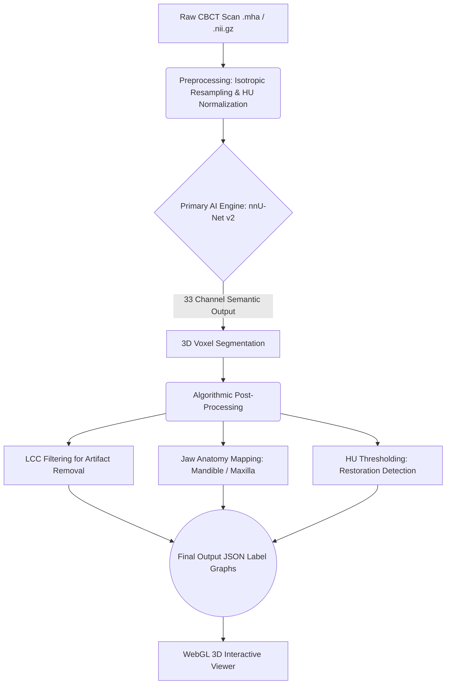
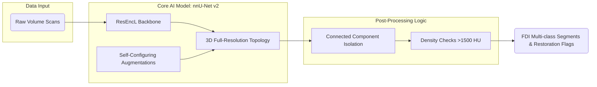

# MaxilloSeg: 3D Dental CBCT Segmentation Pipeline

  

**MaxilloSeg** is a production-ready, deep-learning pipeline engineered to perform highly accurate 3D maxillofacial segmentation on Cone Beam Computed Tomography (CBCT) scans. Designed to seamlessly ingest raw `.mha` and `.nii.gz` volumes, the system automates FDI tooth numbering, jawbone classification (Mandible/Maxilla), and detects metallic restorations natively.

> [!IMPORTANT]  
> **Project Status: Architecture & Codebase Complete (Untrained)**  
> *Due to physical hardware and GPU compute constraints, the deep-learning models detailed in this repository have not been actively trained. This repository currently serves as a complete structural, architectural, and procedural codebase mapping out exactly how the inference, preprocessing, and 3D UI logic should be executed once compute becomes available.*

<p align="center">
  
</p>

## 💡 What It Does

Dentistry and oral surgery require precise pre-operative planning. MaxilloSeg automates the tedious process of manual tooth annotation and structural mapping by providing:
1. **Automated FDI Numbering:** Isolates and uniquely labels 32 individual teeth in 3D space.
2. **Anatomical Mapping:** Automatically separates the Mandible (lower jaw) and Maxilla (upper jaw) structures.
3. **Restoration Flagging:** Detects crowns, implants, and metallic artifacts by evaluating material density (Hounsfield Units).
4. **Interactive 3D Visualization:** Allows users to view and manipulate the generated 3D segmentations directly in any web browser without needing heavy clinical software.

## ⚙️ How It Works (Pipeline)

The workflow consists of three distinct phases: **Preprocessing**, **AI Inference**, and **Algorithmic Post-Processing**.



1. **Preprocessing:** Scans are resampled to uniform voxel spacing and normalized to standard Hounsfield Unit (HU) densities. This ensures the AI model receives consistent, unskewed spatial data regardless of the scanning machine.
2. **AI Inference:** The core `nnU-Net` model processes the volume to assign semantic classes (Background + 32 FDI teeth) to every 3D voxel coordinate.
3. **Refinement:** The system algorithms drop isolated floating pixels (artifacts), calculate which teeth belong to the upper or lower jaw based on geometric coordinates, and flag metallic density anomalies (>1500 HU) as specific dental restorations.

## 🏗️ System Architecture

MaxilloSeg utilizes a two-pronged strategy: a self-configuring neural network architecture paired with rigid deterministic post-processing algorithms.



*   **Backbone:** We utilize the robust 3D full-resolution layout using a Residual Encoder (`ResEncL`) preset from `nnU-Net v2`.
*   **Why nnU-Net?:** It automatically analyzes voxel spacings and class imbalances, autonomously configuring batch sizes and augmentations. It eliminates human bias from the preprocessing layer, routinely achieving benchmark-breaking performance in medical datasets.

## 📂 Codebase Structure

The repository is cleanly segmented into pipeline actions:

```text
cbct_seg/
├── scripts/
│   ├── nnunet_pipeline.py      # Production workflow (Convert → Preprocess → Train → Infer)
│   ├── unet_inference.py       # Standalone Sliding-window inference logic
│   ├── unet_training.py        # Fallback PyTorch 3D U-Net baseline architecture
│   └── unet_preprocessing.py   # Baseline volume manipulation (Isotropic Resampling / HU Norm)
├── viewer/
│   └── index.html              # Custom interactive 3D WebGL viewer (Drag-and-drop .json)
├── assets/                     # Documentation UI materials       
└── Dockerfile                  # Baseline Ubuntu + CUDA Container spec orchestration
```

## 🚀 Execution & Deployment

When compute becomes available, the pipeline is fully pre-configured to build entirely in the cloud or via local Docker containers.

### Google Colab Execution
1. Ensure the dataset `.zip` is uploaded to Google Drive.
2. Open `COLAB_GUIDE.md` and execute the defined cells sequentially. 
3. The codebase dynamically interfaces with broken zip structures and establishes proper `dataset.json` keys to execute Epoch 1.

### Local Docker Orchestration
```bash
# Build the container
docker build -t maxilloseg-pipeline .

# Simulate single-scan inference (Requires pre-trained weights in /runs)
docker run --gpus all -v /data:/data -v /runs:/runs -v /results:/results maxilloseg-pipeline
```

## 📊 Evaluation Criteria

Once trained, the pipeline will evaluate via the following metrics across 33 semantic classes:
* **Dice Coefficient:** Volumetric overlap accuracy per FDI tooth.
* **Hausdorff95:** Edge-boundary structural alignment tracking in absolute millimeters.
